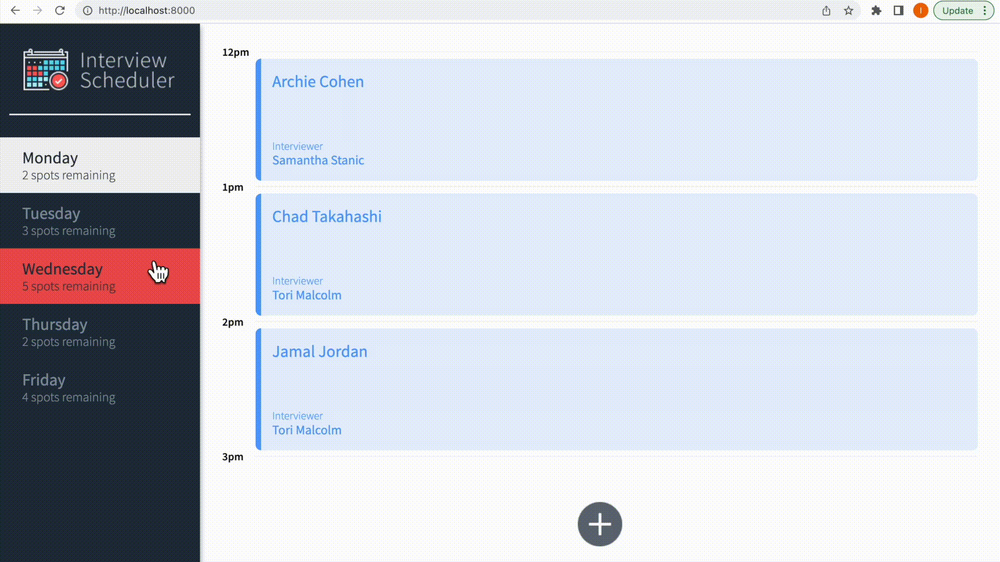

Interview Scheduler

Interview Scheduler is a single page application (SPA) built using React. It allows users to book and manage interviews with interviewers. Data is persisted by an API server using a PostgreSQL database, and the client application communicates with the server over HTTP using the JSON format.

Getting Started

Clone this repository.
Install dependencies using the npm install command.
Start the web server using the npm run local command. The app will be served at http://localhost:8080/.
Go to http://localhost:8000/ in your browser.

Backend Setup

Install the separate scheduler-api for mock data by going to https://github.com/lighthouse-labs/scheduler-api.
Follow its README.md, npm install.
Start the database server using npm start.
Go to http://localhost:8001/ in your browser.
If you need to reset the database to its randomly generated default, visit http://localhost:8001/api/debug/reset.

Features

Book interviews between Monday and Friday
Switch between weekdays to view available interview slots
Book an interview in an empty appointment slot by typing in a student name and selecting an available interviewer from a list
Cancel an existing interview
Edit the details of an existing interview
View the number of available slots for each day
The expected day updates the number of spots available when an interview is booked or canceled
A confirmation message is displayed when attempting to cancel an interview
Error messages are displayed when an interview cannot be saved or deleted
Status indicators are displayed while asynchronous operations are in progress
Pressing the close button on an error message returns the user to the Form or Show view (skipping Status and Confirm)
Data is loaded and persisted using API requests, and is not lost after a browser refresh

Testing

Jest and Cypress tests are used throughout the development of the project to ensure that the application functions correctly and reliably.

Setup
Install dependencies with npm install.

Running Webpack Development Server
npm start

Running Jest Test Framework
npm test

Running Storybook Visual Testbed
npm run storybook

Dev Dependencies

axios": "^0.26.0"
cypress": "^9.5.1"
classnames": "^2.2.6"
normalize.css": "^8.0.1"
react": "^16.9.0"
react-dom": "^16.9.0"
react-scripts": "3.0.0"

Acknowledgments
This project was created as part of the Web Development program at Lighthouse Labs. Special thanks to our instructor and TAs for their guidance and support throughout the development process.

License
This project is licensed under the MIT License - see the LICENSE.md file for details.